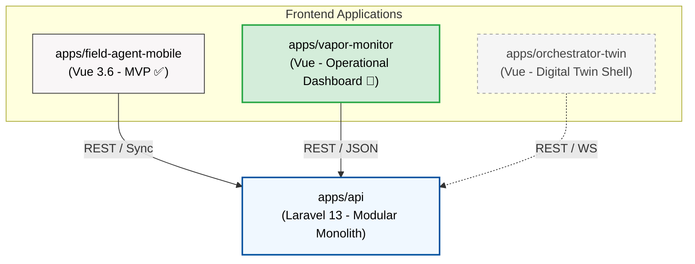
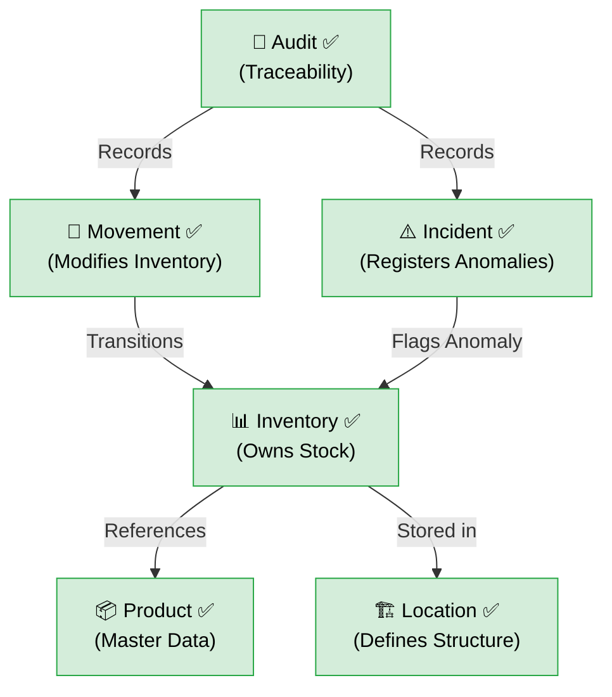
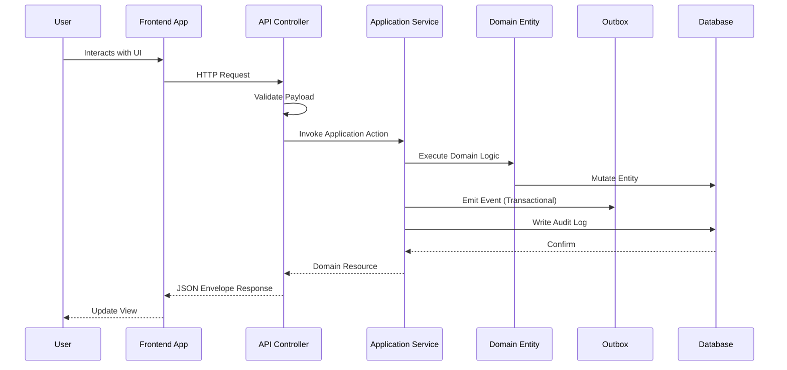
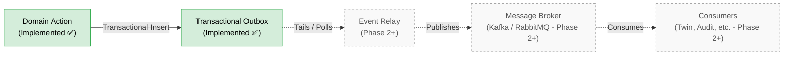
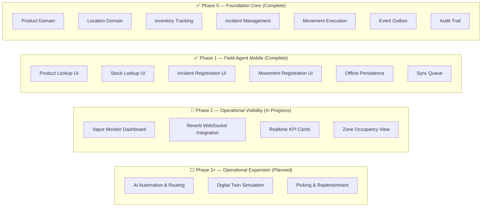

# NexusWMS

**NexusWMS** is an agentic warehouse orchestration portfolio project designed to demonstrate modern logistics workflows in 2026.

This repository serves as a showcase of a production-grade **Modular Monolith** architecture combined with **AI-Assisted Governance**, proving how complex domain rules, strict event sourcing, and high-concurrency systems can be built reliably using AI coding agents.

---

## 🚀 Current Project State

**Phase 2: Operational Visibility — (Status: In Progress)**

| Phase | Description | Status |
|-------|-------------|--------|
| **Phase 0** | Foundation Core — Domain model, API contracts, event system, audit layer | ✅ Complete |
| **Phase 1** | Field-Agent Mobile Core — Mobile-first field workflows, offline persistence | ✅ Complete |
| **Phase 2** | Operational Visibility — Realtime dashboard, event monitoring | 🔄 In Progress |
| **Phase 3** | Operational Expansion — Picking, replenishment, AI automation | ⬜ Planned |

### Phase 0 Achievements (Foundation Core)

- **7 domains** implemented: Product, Locations, Inventory, Movements, Incidents, Events, Audit
- **49 automated tests**, 218 assertions, 8 end-to-end validation scenarios — 0 failures
- Full API contract alignment with envelopes, pagination, error codes, camelCase, actor identity
- Transactional Outbox for atomic event emission
- Immutable audit trail for all state-changing operations
- AI governance enforced from day one

### Phase 1 Achievements (Field-Agent Mobile Core)

- Product lookup & stock lookup UI
- Incident registration from the field
- Simple movement execution (inbound, outbound, transfer)
- Offline-first local persistence foundation
- Sync queue for connectivity gap handling

### Phase 2 Focus (Operational Visibility)

- Realtime dashboard foundation (`apps/vapor-monitor`)
- WebSocket integration via Laravel Reverb
- Event-driven monitoring UI for inbound, outbound, and incidents
- KPI visibility for operational decision-making
- Occupancy visibility by zone

---

## 🤖 AI Governance: What and Why?

A unique structural element of this project is the **[`.ai/`](.ai/) folder**. 

### Why do we need AI Governance?
When utilizing AI coding assistants (like Copilot, Cursor, or autonomous agents) to build a complex domain like a Warehouse Management System, the LLMs often hallucinate architectural drift, invent generic REST endpoints, or bypass transactional boundaries (e.g., modifying inventory without emitting an audit event).

### How it works
The [`.ai/`](.ai/) directory acts as an impenetrable "prompt firewall" and ruleset for any AI touching this codebase. It enforces **Architectural Governance as Code**, ensuring that the AI operates within strict backend boundaries:
- **[`RULES.md`](.ai/RULES.md)** & **[`DOMAIN_MODEL.md`](docs/DOMAIN_MODEL.md):** Prevents the AI from hallucinating incorrect warehouse logic (e.g., deleting stock instead of emitting an adjustment event).
- **[`AGENTS.md`](.ai/AGENTS.md):** Constrains AI behavior. For example, it strictly forbids the AI from writing scripts that directly poll the `event_outbox` table, forcing it to use the bounded REST APIs to respect transactional atomicity.
- **[`EVALS.md`](.ai/EVALS.md)** & **[`REVIEW_CHECKLIST.md`](.ai/REVIEW_CHECKLIST.md):** Standardizes how the AI validates its own work against the defined domain model before submitting PRs or finalizing tasks.

By explicitly documenting the architecture in a machine-readable format, NexusWMS proves that LLM-driven development can be deterministic, auditable, and architecturally sound.

---

## Architecture Overview

### 1. Monorepo Architecture

The architectural layout of the NexusWMS portfolio, showing the relationship between the frontends and the monolithic backend.

### 2. Domain Model Overview

The domain model emphasizes the division of responsibilities across the warehouse execution core. All domains are implemented and validated.

### 3. Request Flow (Current State)

The synchronous flow of data from user interaction through the bounded domain layer.

### 4. Event Flow

The Transactional Outbox pattern is implemented. Event Relay and Message Broker are planned for Phase 2+.

### 5. MVP Scope Diagram

A visual boundary of what was delivered in Phase 0 (Foundation Core) and what Phase 1 adds.

---

## 📦 App Surfaces

- [`apps/api`](apps/api): Laravel 13 backend (System of Record, Domain Logic).
- [`apps/vapor-monitor`](apps/vapor-monitor): Real-time monitoring dashboard (Vue 3.6) — **Phase 2 active target**.
- [`apps/field-agent-mobile`](apps/field-agent-mobile): Mobile operational capture (Vue 3.6) — **Phase 1 complete**.
- [`apps/orchestrator-twin`](apps/orchestrator-twin): Tactical simulation layer (Vue 3.6).

## 🏗️ Architecture Principles
- **Modular Monolith:** Event-driven internal communication, zero circular dependencies.
- **Transactional Outbox:** Guaranteed atomicity between state mutations and event emissions.
- **Idempotency Store:** 24-hour Redis TTL to protect against duplicated network boundaries.
- **Event-Driven State:** Immutable facts emitted after every successful domain mutation.
- **Offline-First:** Local persistence with queue-based sync for field operations (Phase 1).
