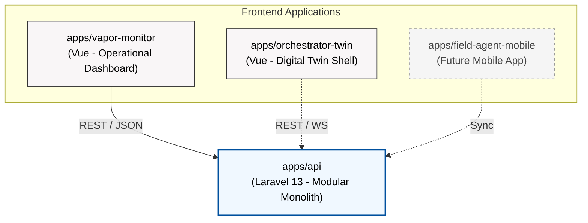
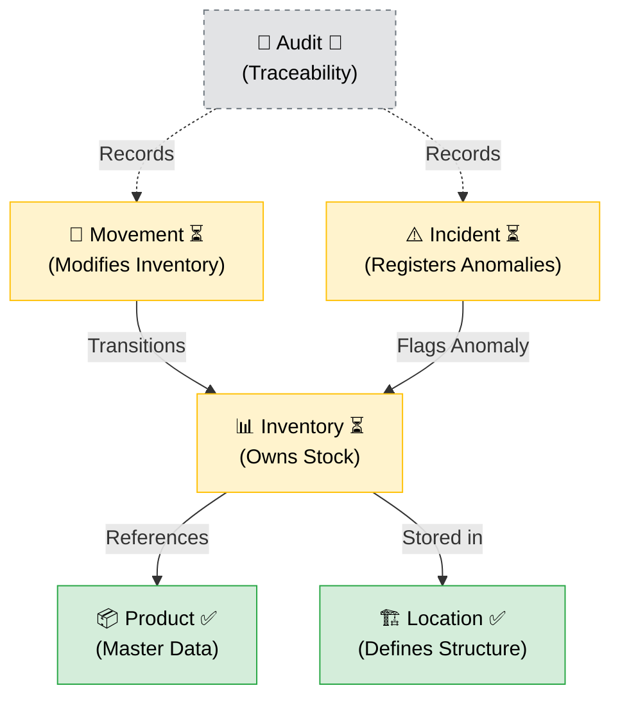
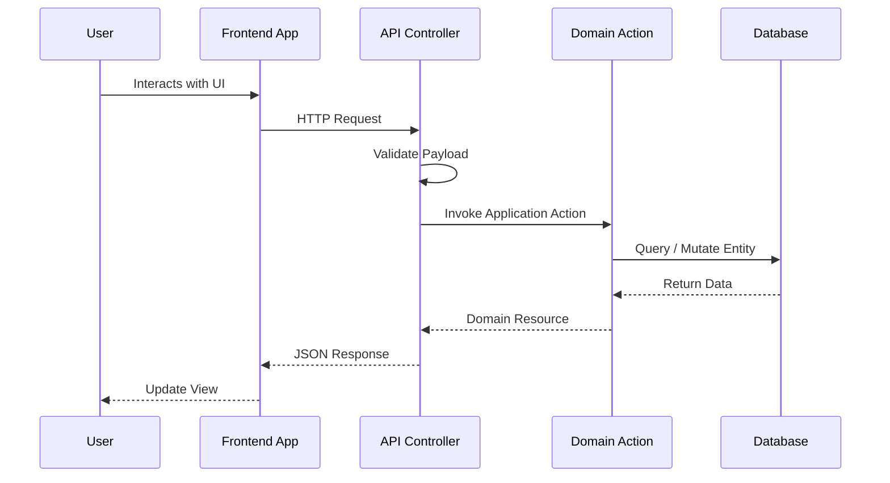
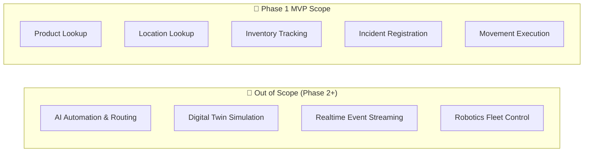

# NexusWMS

**NexusWMS** is an agentic warehouse orchestration portfolio project designed to demonstrate modern logistics workflows in 2026.

This repository serves as a showcase of a production-grade **Modular Monolith** architecture combined with **AI-Assisted Governance**, proving how complex domain rules, strict event sourcing, and high-concurrency systems can be built reliably using AI coding agents.

---

## 🚀 Current Project State

**Phase 1: Foundation Core MVP – (Status: Active Development)**

The project is currently focused on the backend implementation of its Foundation Core:
- **Completed:** Deep architectural audit, API contract alignment, schema definition, and strict event envelope enforcement.
- **In Progress:** Laravel 13 backend implementation for synchronous Inventory, Locations, Movements, and Incidents logic.
- **Deferred:** Offline-first mobile syncing, Kafka/RabbitMQ event streaming, and Orchestrator Twin 3D simulation (all deferred to Phase 2+).

---

## 🤖 AI Governance: What and Why?

A unique structural element of this project is the **[`.ai/`](.ai/) folder**. 

### Why do we need AI Governance?
When utilizing AI coding assistants (like Copilot, Cursor, or autonomous agents) to build a complex domain like a Warehouse Management System, the LLMs often hallucinate architectural drift, invent generic REST endpoints, or bypass transactional boundaries (e.g., modifying inventory without emitting an audit event).

### How it works
The [`.ai/`](.ai/) directory acts as an impenetrable "prompt firewall" and ruleset for any AI touching this codebase. It enforces **Architectural Governance as Code**, ensuring that the AI operates within strict backend boundaries:
- **[`RULES.md`](.ai/RULES.md)** & **[`DOMAIN_MODEL.md`](docs/DOMAIN_MODEL.md):** Prevents the AI from hallucinating incorrect warehouse logic (e.g., deleting stock instead of emitting an adjustment event).
- **[`AGENTS.md`](.ai/AGENTS.md):** Constrains AI behavior. For example, it strictly forbids the AI from writing scripts that directly poll the `event_outbox` table, forcing it to use the bounded REST APIs to respect transactional atomicity.
- **[`EVALS.md`](.ai/EVALS.md)** & **[`REVIEW_CHECKLIST.md`](.ai/REVIEW_CHECKLIST.md):** Standardizes how the AI validates its own work against the defined domain model before submitting PRs or finalizing tasks.

By explicitly documenting the architecture in a machine-readable format, NexusWMS proves that LLM-driven development can be deterministic, auditable, and architecturally sound.

---

## Architecture Overview

### 1. Monorepo Architecture

The architectural layout of the NexusWMS portfolio, showing the relationship between the frontends and the monolithic backend.

### 2. Domain Model Overview

The domain model emphasizes the division of responsibilities across the warehouse execution core.

### 3. Request Flow (Current State)

The synchronous flow of data from user interaction through the bounded domain layer.

### 4. Event Flow (Conceptual)

The planned asynchronous architecture for event distribution. **Note: Event Relay and Message Broker are not yet implemented.**

```mermaid
flowchart LR
    classDef current fill:#e3f2fd,stroke:#0d47a1,color:#000
    classDef future fill:#f9f9f9,stroke:#999,stroke-dasharray: 4 4,color:#555

    Action["Domain Action\n(Current)"]:::current
    Outbox["Transactional Outbox\n(Database)"]:::current
    Relay["Event Relay\n(Future)"]:::future
    Bus["Message Broker\n(Kafka / RabbitMQ - Future)"]:::future
    Consumers["Consumers\n(Twin, Audit, etc. - Future)"]:::future

    Action -->|Transactional Insert| Outbox
    Outbox -.->|Tails / Polls| Relay
    Relay -.->|Publishes| Bus
    Bus -.->|Consumes| Consumers
```

### 5. MVP Scope Diagram

A visual boundary of what is included in the initial MVP versus what is explicitly out of scope for Phase 1.

---

## 📦 App Surfaces

- [`apps/api`](apps/api): Laravel 13 backend (System of Record, Domain Logic).
- [`apps/vapor-monitor`](apps/vapor-monitor): Real-time monitoring dashboard (Vue 3.6).
- [`apps/field-agent-mobile`](apps/field-agent-mobile): Mobile operational capture (Vue 3.6).
- [`apps/orchestrator-twin`](apps/orchestrator-twin): Tactical simulation layer (Vue 3.6).

## 🏗️ Architecture Principles
- **Modular Monolith:** Event-driven internal communication, zero circular dependencies.
- **Transactional Outbox:** Guaranteed atomicity between state mutations and event emissions.
- **Idempotency Store:** 24-hour Redis TTL to protect against duplicated network boundaries.
- **Event-Driven State:** Immutable facts emitted after every successful domain mutation.
